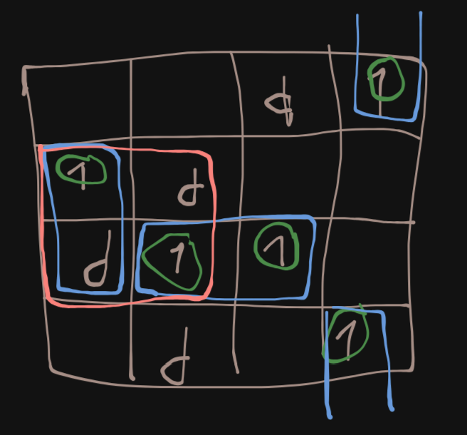

### Вариант 1
#### Теория:
- $y=f^4(x)$ - означает, что функция y зависит от пременной x состоящей из 4 логических значений, при этом число x обычно представляется в виде числа 10й СС
#### Алгоритм:
1. Построить таблицу значений функции 4x4, где стобцы обозначают значения первых двух битов x, а строки последних двух
2. Составить минимальную ДНФ в несколько шагов:
	1. Мы можем использовать конъюнкцию из четырех переменных для описация каждого положительного значения функции, чтобы описать каждую из единиц, однако цена этого слишком велика
	2. Заметим, что некоторые положительные значения функции не зависят от изменения какого-то одного байта, объединим эти значения, записав их в виде конъюнкции из трех переменных
	3. Аналогичным образом мы можем двигаться дальше, сокращая цену функции (тут важно, чтобы "прямоугольнички" не заходили на нулевое значение функции)
   Запишем результат в виде МДНФ   
3. Упростим функцию, применив двойное отрицание и приведя функцию к базису (ИЛИ-НЕ)
4. Составим схему
5. Получим определенные результаты для наобоо
6. Аналогично пунктам 1-5